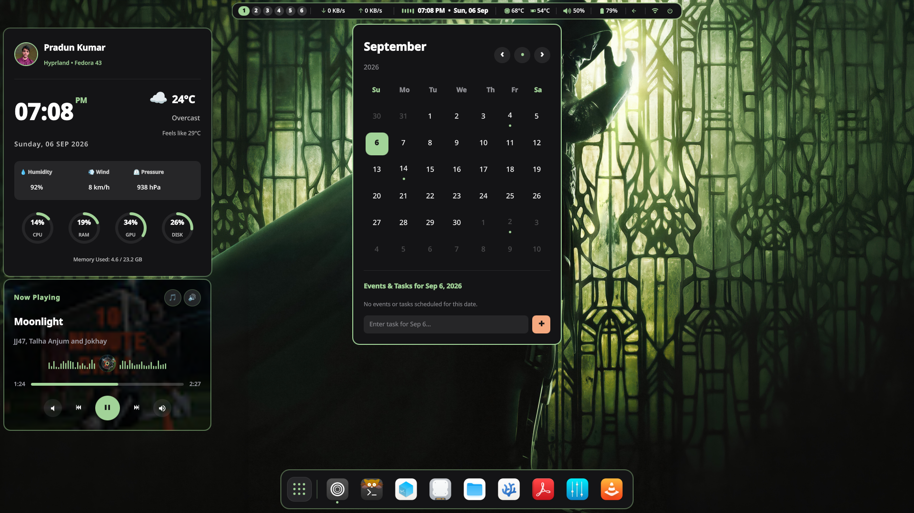
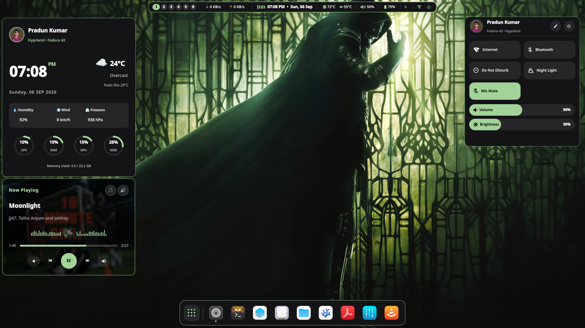

# 🧊 Liquid Glass Hyprland | Fedora

> A modern Hyprland desktop focused on performance, aesthetics, and an efficient Cyber Security workflow.


---

## 📸 System Gallery

| | | |
|:-:|:-:|:-:|
|  |  |  |
|  |  |  |
|  |  |  |
|  |  |  |

# 💻 Hardware

| Component | Specification |
|------------|--------------|
| **Laptop** | Lenovo LOQ 15IRX9 (2024) |
| **CPU** | Intel Core i5-13450HX |
| **GPU** | NVIDIA RTX 3050 6GB |
| **RAM** | 24GB DDR5 |
| **Storage** | 512GB NVMe (Fedora) + 256GB NVMe (VM Storage) |
| **Primary Monitor** | Acer EK251Q P2 • 1920×1080 • 144Hz |
| **Secondary Monitor** | Built-in 15.6" FHD |

---

# ✨ Features

- 🧊 Liquid Glass UI with Gaussian Blur
- 🎨 Dynamic wallpaper management using **awww** and **Matugen**
- 🌈 Automatic keyboard RGB synchronization (Lenovo LegionAura)
- 🖥️ Dual-monitor optimized layout
- 🚀 Hardware accelerated Wayland rendering
- 🧩 **100% Custom-built Quickshell Widgets** (Completely self-written UI Architecture)
- ⚡ Smooth Hyprland animations
- 📂 Smart floating and tiling window rules
- 🔔 Modern notification center
- 🔍 Spotlight launcher
- 🎛️ Control Center
- 🔋 Battery & system telemetry widgets
- 📋 Clipboard history
- 🖼️ Workspace overview
- 🎯 Optimized for productivity

---

# 📦 Main Components

- Fedora
- Hyprland
- Quickshell
- Kitty
- awww
- Matugen
- Zen Browser
- VS Codium
- Nautilus
- Fastfetch

---

# 🛠 Installation

Setting up this configuration on a fresh Fedora install is completely automated.

1. **Clone the repository:**
   ```bash
   git clone https://github.com/pradun-oops/hyprland.git
   cd hyprland
   ```

2. **Run the installation script:**
   This handles all DNF package dependencies, sets up the required Copr repositories, compiles `awww` via Cargo, installs Ruby tools, and configures systemd services.
   ```bash
   ./scripts/install.sh
   ```

3. **Run the setup script:**
   This will securely mirror the entire repository into your `~/.config` directory and instantly reload Hyprland.
   ```bash
   ./scripts/setup.sh
   ```

---

# 📁 Repository Structure

```text
.
├── assets/
├── configs/
├── fastfetch/
├── kitty/
├── matugen/
├── quickshell/
├── scripts/
├── Wallpapers/
├── hyprland.lua
└── README.md
```

---

# ❤️ Credits

- Hyprland
- Fedora Project
- Quickshell
- awww
- Matugen