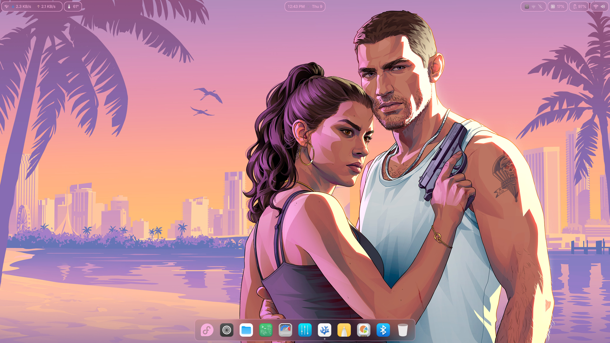
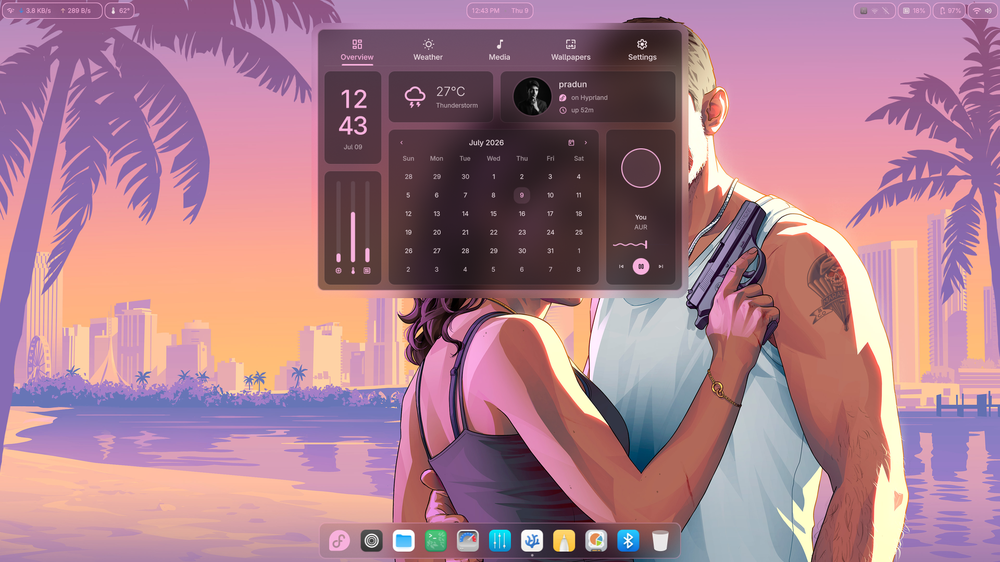
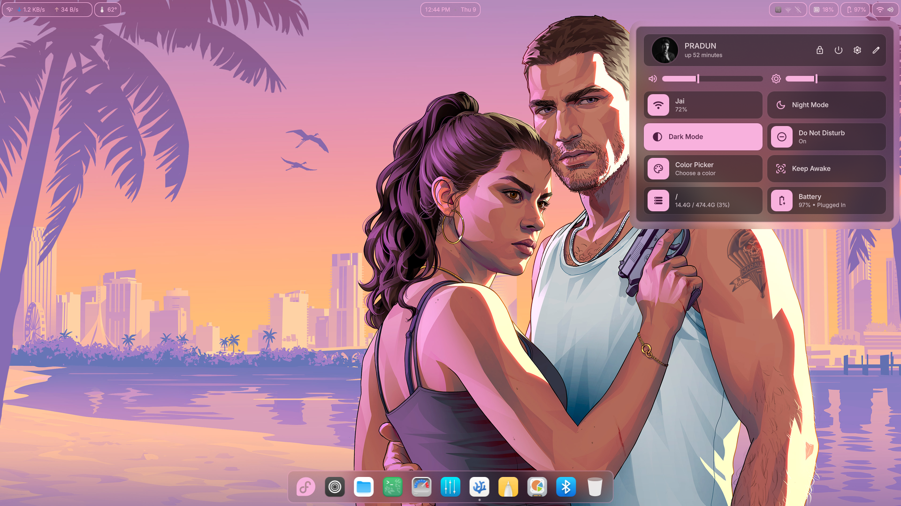
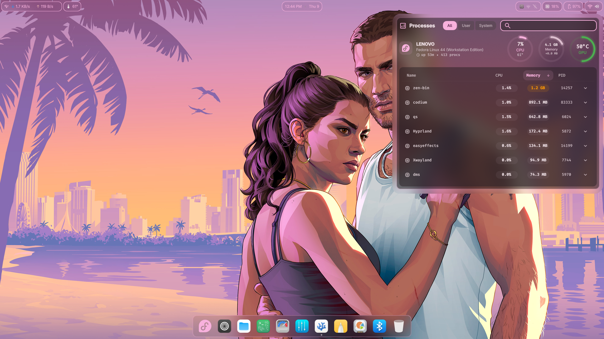
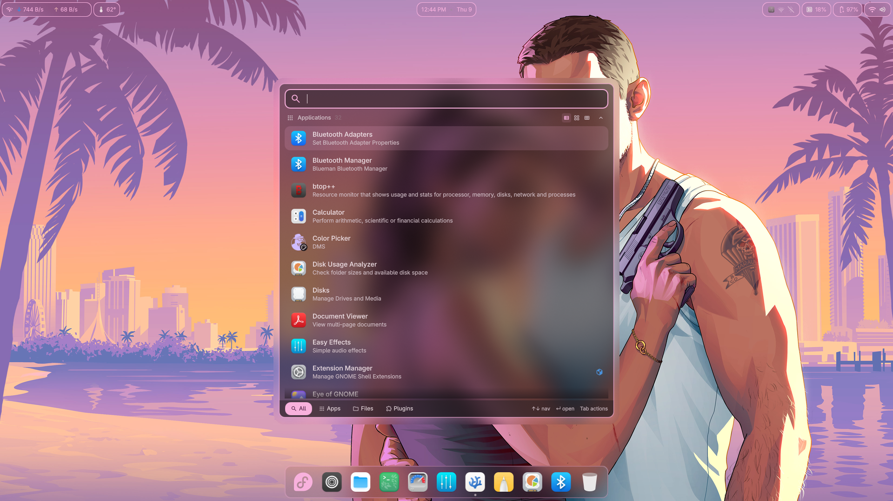
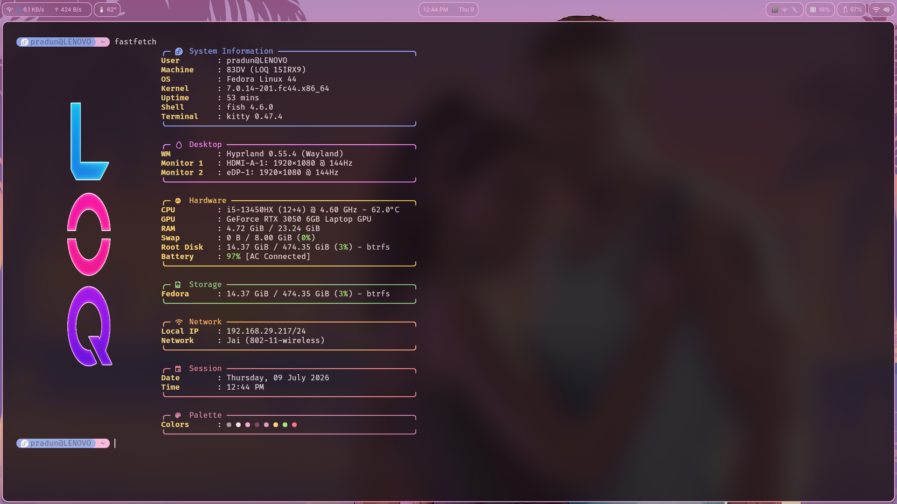
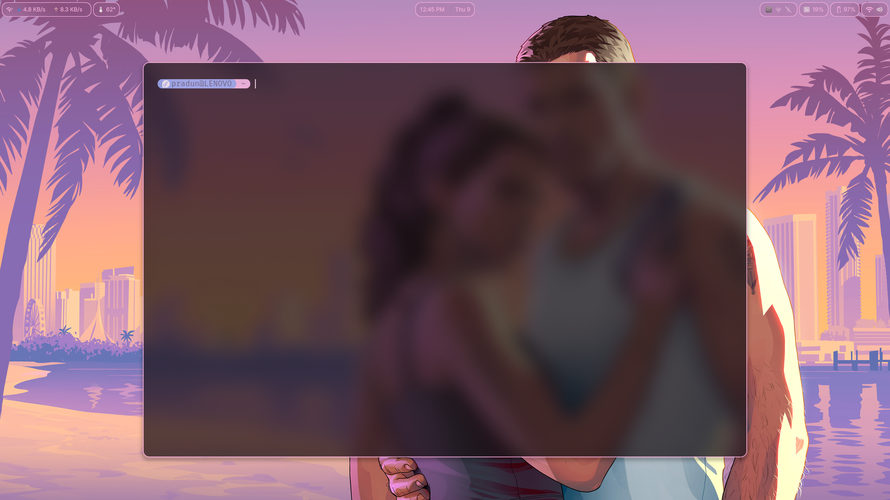
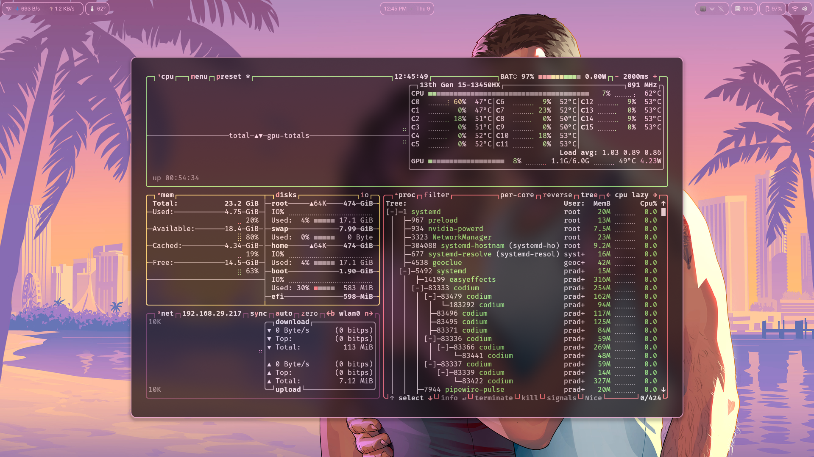
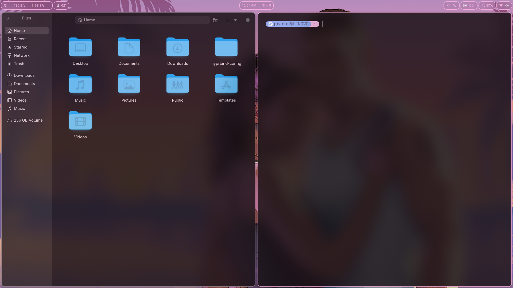

# 🧊 Liquid Glass Hyprland | Fedora

> A modern Hyprland desktop focused on performance, aesthetics, and an efficient Cyber Security workflow.


---

## 📸 System Gallery

| | | |
|:-:|:-:|:-:|
|  |  |  |
|  |  |  |
|  |  |  |

# 💻 Hardware

| Component | Specification |
|------------|--------------|
| **Laptop** | Lenovo LOQ 15IRX9 (2024) |
| **CPU** | Intel Core i5-13450HX |
| **GPU** | NVIDIA RTX 3050 6GB |
| **RAM** | 24GB DDR5 |
| **Storage** | 512GB NVMe (Fedora) + 256GB NVMe (VM Storage) |
| **Primary Monitor** | Acer EK251Q P2 • 1920×1080 • 144Hz |
| **Secondary Monitor** | Built-in 15.6" FHD |

---

# ✨ Features

- 🧊 Liquid Glass UI with Gaussian Blur
- 🎨 Dynamic wallpaper management using **Waypaper** + **swww**
- 🌈 Automatic keyboard RGB synchronization
- 🖥️ Dual-monitor optimized layout
- 🚀 Hardware accelerated Wayland rendering
- 🧩 Dank Material Shell
- ⚡ Smooth Hyprland animations
- 📂 Smart floating and tiling window rules
- 🔔 Modern notification center
- 🔍 Spotlight launcher
- 🎛️ Control Center
- 🔋 Battery & system widgets
- 📋 Clipboard history
- 🖼️ Workspace overview
- 🎯 Optimized for productivity

---

# 🛡️ Cyber Security Workflow

Workspace | Purpose
--------- | -------
1 | Browser & Documentation
2 | Kali Linux VM & Codium
3 | Research
4 | Notes
5 | VirtualBox Manager
6–10 | General Development & Multitasking

---

# 📦 Main Components

- Fedora
- Hyprland
- Dank Material Shell
- Kitty
- Waybar (optional)
- Quickshell
- Swww
- Waypaper
- Zen Browser
- VS Codium
- Nautilus
- Fastfetch
- Btop

---

# 🛠 Installation

Install the required packages:

```bash
sudo dnf install hyprland kitty nautilus swww waypaper \
fastfetch btop entr jq ddcutil brightnessctl \
libnotify slurp wf-recorder \
xdg-desktop-portal-hyprland inotify-tools
```

Clone the repository:

```bash
git clone https://github.com/<your-username>/<repo>.git
cd <repo>
```

Copy the configuration:

```bash
cp -r .config/* ~/.config/
```

Reload Hyprland:

```bash
hyprctl reload
```

---

# 📁 Repository Structure

```text
.
├── assets/
├── hypr/
├── kitty/
├── quickshell/
├── scripts/
└── README.md
```

---

# ❤️ Credits

- Hyprland
- Dank Material Shell
- Fedora Project
- Quickshell
- Waypaper
- Swww

---

## ⭐ If you like this setup, consider starring the repository!