# 🧊 Liquid Glass Hyprland | Fedora

> A modern Hyprland desktop focused on performance, aesthetics, and an efficient cybersecurity workflow.

<p align="center">

  

  

  

  

  

</p>

---

## 📸 System Gallery

<p align="center">
  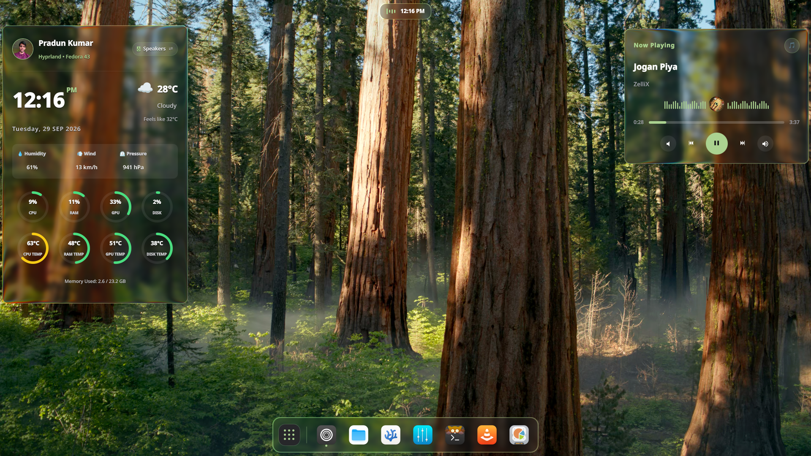
  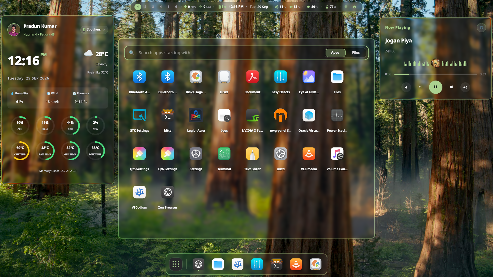
  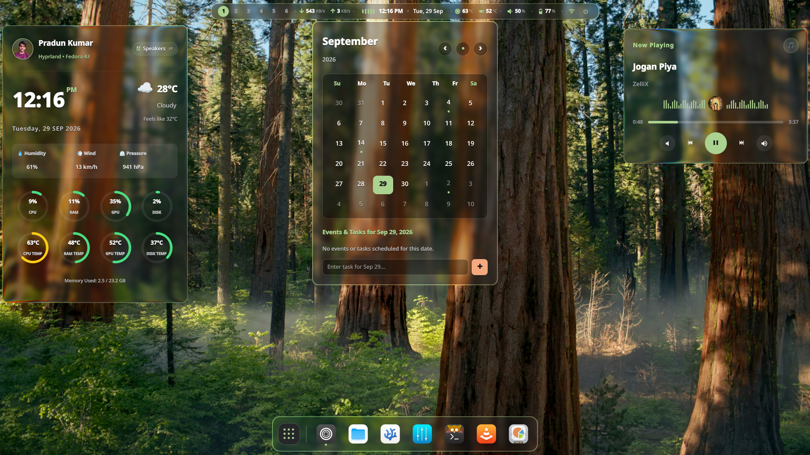
</p>

<p align="center">
  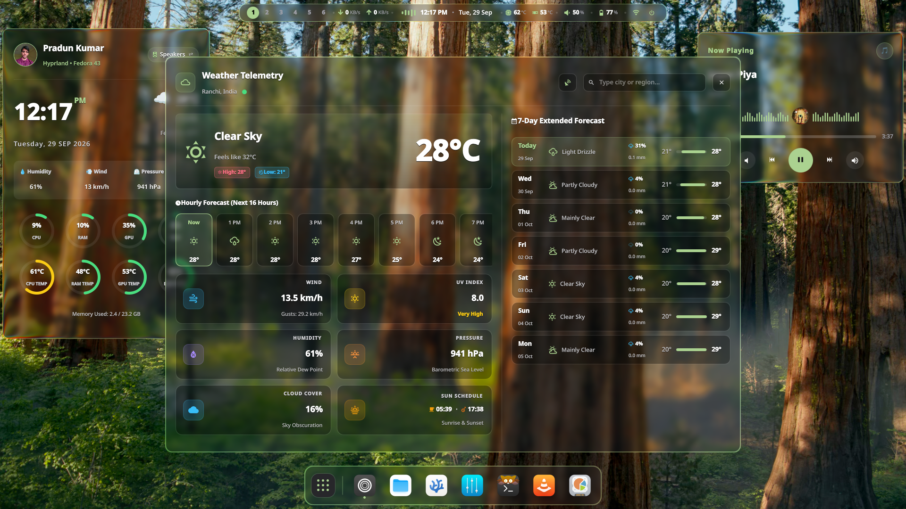
  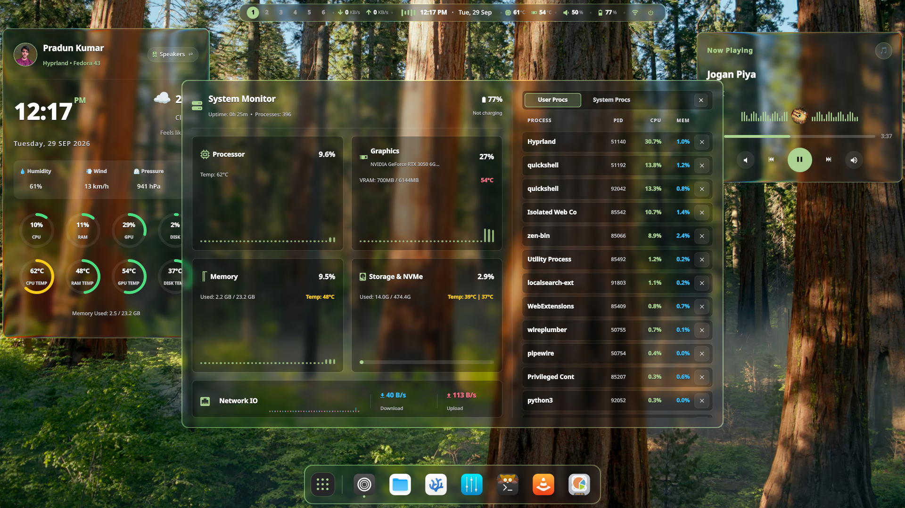
  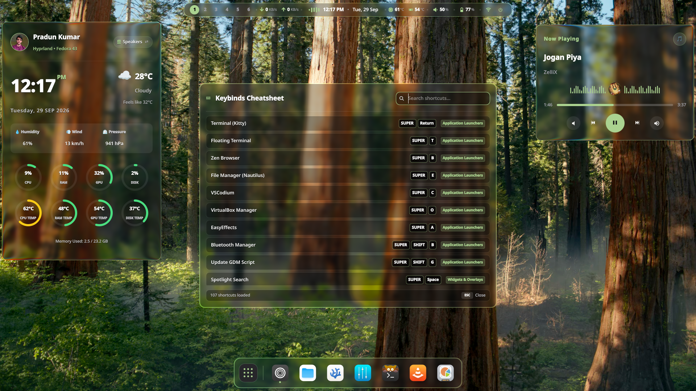
</p>

<p align="center">
  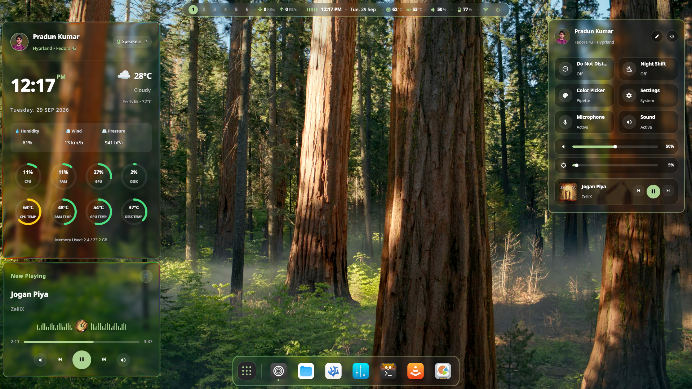
  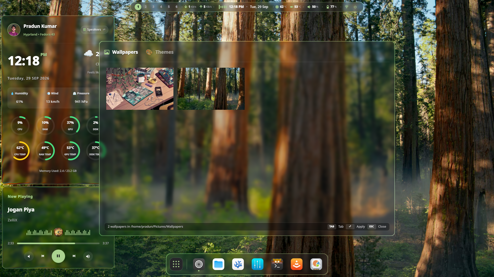
  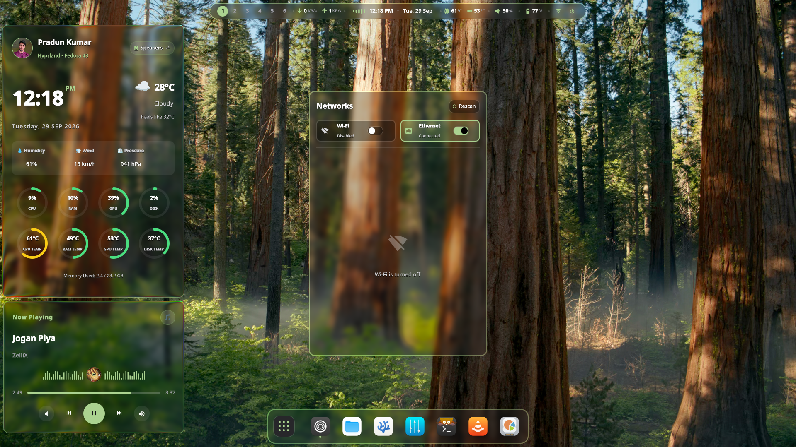
</p>

<p align="center">
  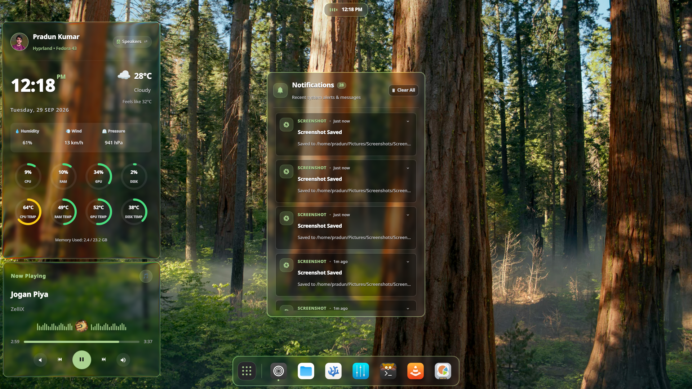
  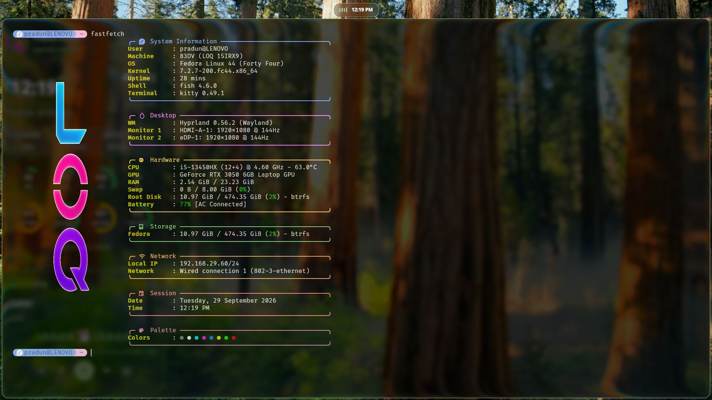
  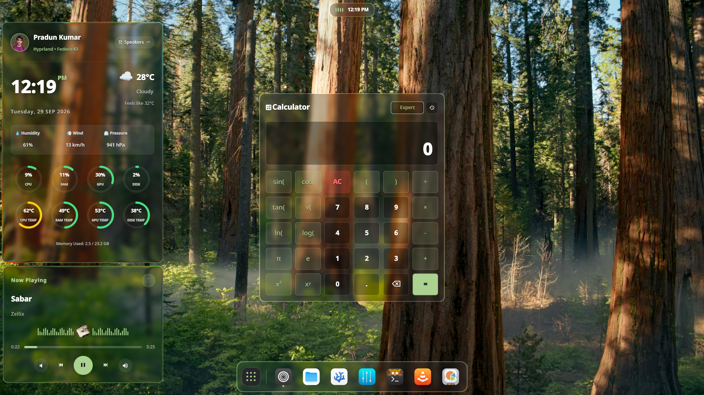
</p>

---

# 💻 Hardware

| Component | Specification |
|---|---|
| **Laptop** | Lenovo LOQ 15IRX9 (2024) |
| **CPU** | Intel Core i5-13450HX |
| **GPU** | NVIDIA RTX 3050 6GB |
| **RAM** | 24GB DDR5 |
| **Storage** | 512GB NVMe (Fedora) + 256GB NVMe (VM Storage) |
| **Primary Monitor** | Acer EK251Q P2 • 1920×1080 • 144Hz |
| **Secondary Monitor** | Built-in 15.6" FHD |

---

# ✨ Features

- 🧊 **Liquid Glass UI** with Gaussian blur
- 🎨 Dynamic wallpaper management using **awww** and **Matugen**
- 🌈 Automatic keyboard RGB synchronization using **Lenovo LegionAura**
- 🖥️ Dual-monitor optimized layout
- 🚀 Hardware-accelerated Wayland rendering
- 🧩 **100% custom-built Quickshell widgets** with a completely self-written UI architecture
- ⚡ Smooth Hyprland animations
- 📂 Smart floating and tiling window rules
- 🔔 Modern notification center
- 🔍 Spotlight launcher
- 🎛️ Control center
- 🔋 Battery and system telemetry widgets
- 📋 Clipboard history
- 🖼️ Workspace overview
- 🎯 Productivity-focused workflow

---

# 📦 Main Components

| Component | Purpose |
|---|---|
| **Fedora** | Base operating system |
| **Hyprland** | Wayland compositor |
| **Quickshell** | Custom desktop shell and widgets |
| **Kitty** | Terminal emulator |
| **awww** | Dynamic wallpaper daemon |
| **Matugen** | Material You color generation |
| **Zen Browser** | Web browser |
| **VSCodium** | Code editor |
| **Nautilus** | File manager |
| **Fastfetch** | System information display |

---

# 🛠️ Installation

Setting up this configuration on a fresh Fedora installation is designed to be automated through the included scripts.

> ⚠️ **Important:** Review the installation and setup scripts before running them on your system. They may install packages, add repositories, modify configuration files, and change system services.

## 1. Clone the Repository

Clone the repository and enter the scripts directory:

```bash
git clone https://github.com/pradun-oops/hyprland.git
cd hyprland/scripts
```

---

## 2. Run the Installation Script

Run:

```bash
./install.sh
```

The installation script handles the project's required setup, including:

- DNF package dependencies
- Required COPR repositories
- Building `awww` using Cargo
- Ruby tools
- Required system dependencies
- Systemd service configuration

> The exact actions depend on the current contents of `scripts/install.sh`.

---

## 3. Run the Setup Script

After the installation script completes successfully, run:

```bash
./setup.sh
```

The setup script mirrors the repository configuration into your:

```text
~/.config/
```

directory and reloads Hyprland so the configuration can take effect.

> **Tip:** Back up your existing `~/.config` files before applying a new desktop configuration.

---

## 4. Uninstall the Configuration

To remove the installed configuration, run the uninstall script **outside the Hyprland session**:

```bash
./uninstall.sh
```

The uninstall script is intended to remove the packages and configuration files installed by this project.

> ⚠️ **Warning:** Review `uninstall.sh` before execution to understand exactly which packages and files will be removed.

---

# ⌨️ Keybindings

The following are the primary shortcuts configured for this environment.

## 🚀 Core Applications

| Shortcut | Action |
|---|---|
| `SUPER + Return` | Open terminal (Kitty) |
| `SUPER + T` | Open floating terminal |
| `SUPER + B` | Open browser |
| `SUPER + E` | Open file manager (Nautilus) |
| `SUPER + C` | Open editor (VSCodium) |

---

## 🧩 UI & Overlays

| Shortcut | Action |
|---|---|
| `SUPER + Space` | Spotlight search / launcher |
| `SUPER + Tab` | Workspace overview |
| `SUPER + ALT + C` | Toggle control center |
| `SUPER + X` | Power menu |
| `SUPER + V` | Clipboard history |
| `SUPER + W` | Wallpaper selector |

---

## 🪟 Window Management & Navigation

| Shortcut | Action |
|---|---|
| `SUPER + Q` | Close focused window |
| `SUPER + SHIFT + T` | Toggle floating mode |
| `SUPER + F` | Toggle fullscreen |
| `SUPER + H / J / K / L` | Change focus using Vim keys |
| `SUPER + 1–9` | Switch workspace |
| `SUPER + Mouse Drag` | Move window |
| `SUPER + Right Click Drag` | Resize window |

---

## 📸 Screen Capture

| Shortcut | Action |
|---|---|
| `Print` | Screenshot active window |
| `CTRL + Print` | Screenshot selected area |
| `SUPER + CTRL + R` | Record screen area |

---

# 📁 Repository Structure

```text
.
├── assets/
├── configs/
├── fastfetch/
├── kitty/
├── matugen/
├── quickshell/
├── scripts/
├── hyprland.lua
└── README.md
```

### Directory Overview

| Directory / File | Description |
|---|---|
| `assets/` | README screenshots and visual assets |
| `configs/` | Additional desktop configuration files |
| `fastfetch/` | Fastfetch configuration |
| `kitty/` | Kitty terminal configuration |
| `matugen/` | Matugen templates and theme configuration |
| `quickshell/` | Custom Quickshell widgets and UI |
| `scripts/` | Installation, setup, and uninstall scripts |
| `hyprland.lua` | Hyprland configuration |
| `README.md` | Project documentation |

---

# 🎨 Dynamic Theming

The configuration uses **Matugen** to generate a dynamic Material You-inspired color palette based on the current wallpaper.

The general workflow is:

```text
Wallpaper
    │
    ▼
┌──────────────┐
│     awww     │
└──────┬───────┘
       │
       ▼
┌──────────────┐
│    Matugen   │
└──────┬───────┘
       │
       ├──────────────► Hyprland
       │
       ├──────────────► Quickshell
       │
       ├──────────────► Kitty
       │
       └──────────────► Other themed applications
```

This allows the desktop environment to maintain a consistent color palette while changing wallpapers.

---

# 🧊 Liquid Glass Design

The desktop configuration is built around a **Liquid Glass** visual concept, combining:

- Gaussian blur
- Transparency
- Layered surfaces
- Dynamic colors
- Smooth animations
- Rounded UI elements
- Floating panels
- Minimal visual clutter

The goal is to maintain a balance between visual aesthetics and practical usability.

---

# 🔐 Cybersecurity Workflow

The environment is designed with a productivity-oriented cybersecurity workflow in mind.

The desktop configuration provides quick access to:

- Terminal-based security tools
- VSCodium
- Multiple workspaces
- Clipboard history
- File management
- Browser-based research
- System telemetry
- Multiple monitors

The dual-monitor layout can be used to keep security tools, documentation, terminals, and development workflows separated across workspaces and displays.

---

# 🖥️ Multi-Monitor Layout

The configuration is optimized for a dual-monitor setup:

```text
┌──────────────────────────────────────────────┐
│              Acer EK251Q P2                  │
│          1920 × 1080 @ 144 Hz               │
│                                              │
│             Primary Display                  │
└───────────────────────────┬──────────────────┘
                            │
                            │
                ┌───────────▼───────────┐
                │   Laptop Display      │
                │   15.6" FHD           │
                │   Secondary Display   │
                └───────────────────────┘
```

The external Acer monitor is intended to serve as the primary display, while the built-in laptop panel acts as the secondary display when additional workspace is required.

---

# ⚙️ Configuration Philosophy

The configuration aims to provide:

- **Performance** without unnecessary background overhead
- **Consistency** across applications
- **Dynamic theming** based on the active wallpaper
- **Keyboard-driven navigation**
- **Efficient window management**
- **Custom UI components**
- **A practical cybersecurity-focused workspace**

---

# 🐛 Troubleshooting

If something does not work after installation, start by checking the relevant configuration and scripts.

## Reload Hyprland

You can reload the Hyprland configuration with:

```bash
hyprctl reload
```

## Check Hyprland Logs

For Hyprland-related issues, inspect the current session and system logs:

```bash
journalctl --user -b
```

## Check Quickshell

If Quickshell widgets are not appearing, verify that Quickshell is installed and that the relevant configuration exists under:

```text
~/.config/quickshell/
```

## Check Matugen

Verify that Matugen is available:

```bash
matugen --help
```

## Check awww

Verify that `awww` is installed:

```bash
awww --help
```

---

# 🤝 Contributing

Contributions, improvements, bug reports, and feature requests are welcome.

If you would like to contribute:

1. Fork the repository.
2. Create a new branch.
3. Make your changes.
4. Test the configuration.
5. Commit your changes.
6. Open a pull request.

For significant configuration changes, please explain what was changed and why.

---

# ❤️ Credits

This project builds upon and is inspired by the following open-source projects:

- [Hyprland](https://hyprland.org/)
- [Fedora Project](https://fedoraproject.org/)
- [Quickshell](https://quickshell.org/)
- [awww](https://codeberg.org/LGFae/awww)
- [Matugen](https://github.com/InioX/matugen/)

---

# 📄 License

This project is distributed under the **MIT License**.

See the [`LICENSE`](LICENSE) file for the complete license text.

---

<p align="center">
  Built with 🧊, 🐧, and ❤️ for Linux rice enthusiasts.
</p>